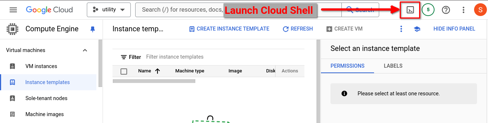

# GCP Label Audit Scripts

The scripts in this directory use the `gcloud` command to generate an
audit of GCP resource labels within each resource type. 

These can be run from your GCP cloud shell and will automatically
obtain an Oauth token scoped to your currently authenticated  user.

The output is intended to be easily filtered with grep.

# Instructions

Launch Cloud Shell:



Clone this repo into your GCP cloud shell:

```
git clone https://github.com/jacobm3/gcp-utils.git
```

```
cd gcp-utils/label-report
./bq.sh
```

Click 'Authorize' to allow the gcloud command to run under your identity.

Sample output:
```
$ ./bq.sh 
"arboreal-avatar-433918-f7","another_dataset","value=medium,best_label_ever=another_label_value"
"arboreal-avatar-433918-f7","my_other_dataset",""
"arboreal-avatar-433918-f7","customer_dataset","value=high,pii=yes"
NO_BQ_API: scce-432418 doesn't have bigquery.googleapis.com API enabled
NO_BQ_API: colab-d4fb9391231f doesn't have bigquery.googleapis.com API enabled
```
