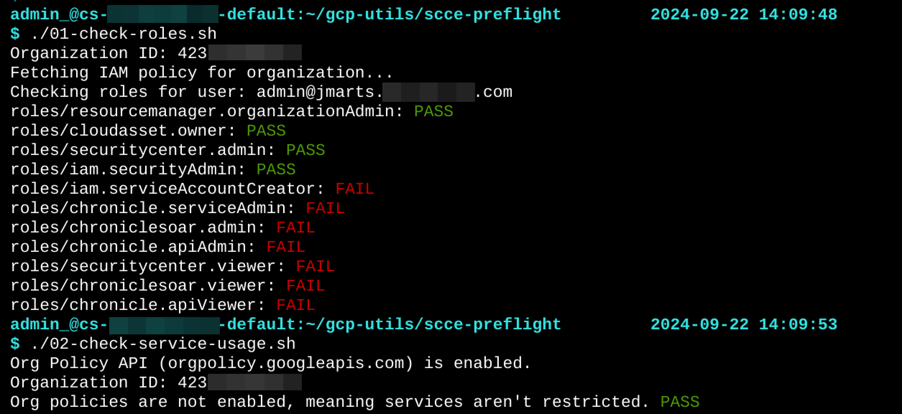

# SCCE Pre-Flight Check Scripts

These scripts can be run from your GCP cloud shell to check if you and your GCP organization meet the requirements to deploy Security Command Center Enterprise (SCCE).

# How-to

Log in to the GCP console with your admin account at https://console.cloud.google.com/

Start a cloud shell.

Clone this repo.

```
git clone https://github.com/jacobm3/gcp-utils.git
cd gcp-utils/scce-preflight
```

Run each of the numbered scripts.  Click "Authorize" if the GCP console sends an Oauth authorization request for the gcloud commands.

```
./01-check-roles.sh

./02-check-service-usage.sh

./03-check-logs.sh
```

Example output:


